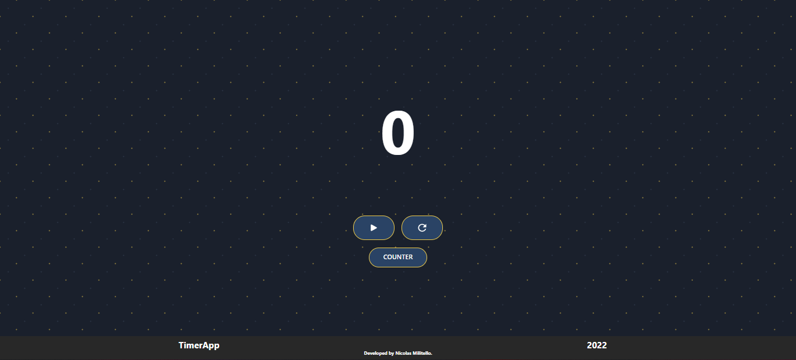
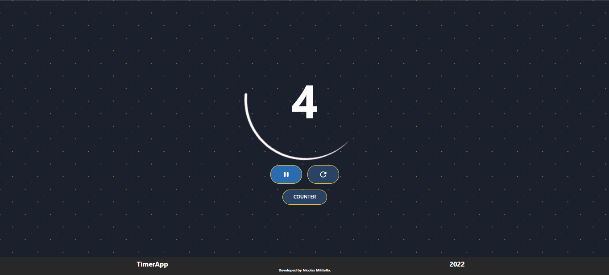
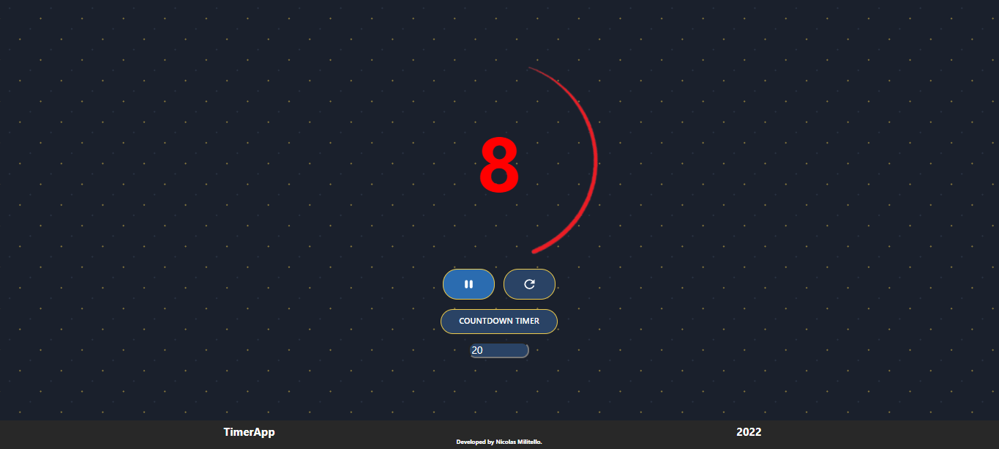

# Timer

This is an easy responsive React App built during Henry's bootcamp.

This app works in two ways. One of them is as a counter and the other one as a countdown timer.

It contains a controlled form for the seconds entry.

The technologies that were used are: Javascript; React and Styled Components.

---

Esta es una sencilla responsive React App realizada durante el bootcamp Henry.

Esta app funciona en dos modos, una como contador, y otra como cuenta regresiva.

Contiene un formulario controlado para la entrada de segundos.

Las tecnologías utilizadas son JavaScript, React y Styled Components.

---

---

Link: https://timer-nicolas-militello.vercel.app/
